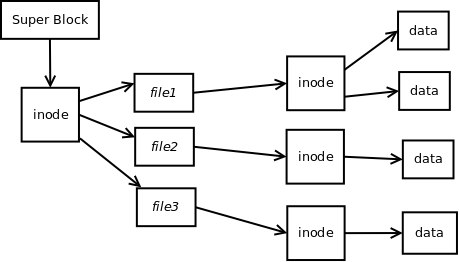

Description
===========

PICFS, which stands for PICOS File System, is designed to be a file system that would balance robustness, simplicity and system memory. Since [[Picos|PICOS]] runs on 8-bit microcontrollers, system memory and simplicity are prioritized. The file system consists of a segment of binary data, called an image. Images may also be mounted in linux using a custom program using the FUSE (http://fuse.sourceforge.net/) library.

Structure
=========

MINIX's (http://en.wikipedia.org/wiki/Minix_file_system) file system served as a inspiration for PICFS. However, PICFS is much simpler. PICFS images are subdivided into blocks, which may be an arbitrary size of up to 256 bytes chosen when the image is created. Any amount of blocks, not exceeding 255, may be used in an image. For simplicity and to save memory, 8-bit addressing of blocks and bytes within blocks was chosen, resulting in the restriction on block size and quantity. However, as multiple images may be mounted in PICOS, this restriction can be overcome, choosing usage complexity over kernel complexity and size.

Borrowing from the MINIX file system, PICFS consists of a linked list of blocks, called inodes, which contain data about the file and pointers to blocks containing the file data. The first block of each image contains information about the file system as well as a pointer to the top most directory. This block is referred to as the super block. Directories themselves are treated exactly like files, where the file name and a pointer to the first block is the data for this directory 'file'.

Free Queue
----------

Unused blocks are contained in a linked list, referred to as the "free queue". The index first block of the free queue is located in the super block. Each free queue block begins with a magic number identifying it as a free block. Then, at byte location of the indirect pointer of an inode, is the index of the next block of the free queue. The last block of the queue will have an indirect pointer value of zero. Since the zero-th block is always the Super Block, it is clear that the queue has ended. Keeping all of the free blocks in a queue makes block allocation very simple.

Raw File
--------

Each file system has one file known as the "raw file". This is a virtual file that will not be listed in the directory entries. In the FUSE system, this will be located in the ''proc'' directory and will be read only. The purpose of this file is to act as a bank of permanent memory to which the PIC device may write. The raw file contains no inodes. The super block contains the index of the first block of the raw file. Each block of the raw file begins with one byte to identify it as a raw file block and another byte that points to the next block in the linked list of raw file blocks. 

By using one, simple linked list as a writable file for the PICOS device, the file writing process and block allocation has been greatly simplified, thus requiring very little firmware memory. At the same time, since user space programs have access to the raw file. Therefore, complex file manipulation and creation has been abstracted "up" to user space programs, which reside in secondary storage rather than firmware space, which is much less abundant.

Each file has one or more inodes. The inode contain the block numbers of the blocks that contain the data of the file. If the number of data blocks exceeds the size of the inode, one of the bytes of the inode points to another inode which contains pointer to more data blocks. Thus, file data block pointers are stored in a linked list of inodes. This structure is shown in the diagram to the right.

Block Descriptions
==================

Super Block
-----------

Each file system images begins with a super block. This block contains the following data, with the remainder of the block left unused:

+-----------------------+-----------+--------------------------------------------------------------------------+
| Data                  | Data size | Description                                                              |
+-----------------------+-----------+--------------------------------------------------------------------------+
| Magic Number          |         1 | Identifies the block as a Super Block. (Value found in picos/tools/fs.h) |
+-----------------------+-----------+--------------------------------------------------------------------------+
| FS Magic Numbers      |         3 | Identifies the image a PICFS image. (Values are 6, 41 and 130            |
+-----------------------+-----------+--------------------------------------------------------------------------+
| Revision Number       |         1 | Used to identify any changes to the file system.                         | 
+-----------------------+-----------+--------------------------------------------------------------------------+
| Block Size            |         1 | Number of bytes per block.                                               |
+-----------------------+-----------+--------------------------------------------------------------------------+
| Number of Blocks      |         1 | Total Number of blocks in the image                                      |
+-----------------------+-----------+--------------------------------------------------------------------------+
| Number of Free Blocks |         1 | Number of free blocks                                                    |
+-----------------------+-----------+--------------------------------------------------------------------------+
| Free Queue Head       |         1 | Index of first free block (see above)                                    |
+-----------------------+-----------+--------------------------------------------------------------------------+
| Raw File Head         |         1 | First block of the raw file (see above)                                  |
+-----------------------+-----------+--------------------------------------------------------------------------+
| Root block            |         1 | Index of the first inode, containing the directory entries.              |
+-----------------------+-----------+--------------------------------------------------------------------------+

INode
-----

Files contain data about files and indices of data blocks. Additionally, inodes may pointer to other inodes to extend the file size. The following is a list of parts of the inode block:

+------------------+--------------------+--------------------------------------------------------------------------------------------------------------------------------------------------------+
| Data             | Data size          | Description                                                                                                                                            |
+------------------+--------------------+--------------------------------------------------------------------------------------------------------------------------------------------------------+
| Magic Number     | 1                  | Identifies the block as an inode. (Value found in picos/tools/fs.h)                                                                                    | 
+------------------+--------------------+--------------------------------------------------------------------------------------------------------------------------------------------------------+
| User ID          | 1                  | This number acts as an identify for a user that owns the file. Currently, this is implemented in the FUSE linux program, but not in PICOS itself.      |
+------------------+--------------------+--------------------------------------------------------------------------------------------------------------------------------------------------------+
| Mode             | 1                  | This identifies read, write and execution permissions for the file. Currently, this is implemented in the FUSE linux program, but not in PICOS itself. | 
+------------------+--------------------+--------------------------------------------------------------------------------------------------------------------------------------------------------+
| Size             | 1                  | Indicates the number of bytes in the file ''in addition'' to the number of ''full blocks''.                                                            |
+------------------+--------------------+--------------------------------------------------------------------------------------------------------------------------------------------------------+
| Indirect Pointer | 1                  | Index of the next inode in the file, treating inodes like a linked list.                                                                               |
+------------------+--------------------+--------------------------------------------------------------------------------------------------------------------------------------------------------+
| Block Pointers   | Remainder of block | Indices of blocks of data of the file.                                                                                                                 |
+------------------+--------------------+--------------------------------------------------------------------------------------------------------------------------------------------------------+

Filesystem Tools
================

Using the FUSE (http://fuse.sourceforge.net) library, PICFS images may be mounted on a computer. In addition to the files stored in the image, the FUSE mounted file system presents a virtual file system in a subdirectory called proc. There are three files in the proc directory which represent the PICFS image in binary, intel hex and HI Tech C include file formats. These files are called "dump", "eeprom" and "picc", respectively. Also in the proc directory is a subdirectory, called "inode", which contains a subdirectory for each file of the PICFS image. Within each file's proc/inode directory is a file for each block of the file. These files contain the raw binary data for each inode and the file name corresponds to the block's index in the file system. Additionally, the proc directory contains the raw file as described above.

The PICOS tool kit (see download section) provides a program to mount PICFS images, called ''mount.picfs''. If no image file is provided to ''mount.picfs'', a new file system is created (in memory). Thus, ''mount.picfs'' may be used to create a PICFS image as well as mount a pre-existing image file. 

When an image file is mounted using ''mount.picfs'', it may either be accessed directly by file operations, treating it as a memory mapped file, or by loading the entire PICFS image into memory. The latter should not be a problem, as PICFS images are limited to 64KB due to the PICOS word size (see PICLANG). However, using the image file as a memory mapped file has the benefit of keeping the image file synchronized with the state of the mounted file system. For example, if the image is mounted by loading the whole image into memory and changes are made to files within the file system, these changes will not be made to the original image. They will, however, be contained in the new images files in the ''proc/'' subdirectory. This setup allows the user to decide whether or not the file system images should be modified.

Another tool, called ''picdisk'', may be used to obtain data about PICFS images. Below is an example output from a 64K file system image. Addresses and sizes are in units of bytes.

*Output of picdisk*
::

    Image #1
    PICFS version 1
    Block size: 255
    Number of Blocks: 255
    Number of Free Blocks: 176
    Root block: 255
    Starting address: 0
    Contains raw file: no
    Total Size: 65025

Download
========

A sample 32MB PICFS image may be downloaded at http://research.davecoss.com/sdcard.img. Also, sample images are included in PICOS source and debian packages.

