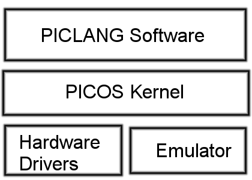
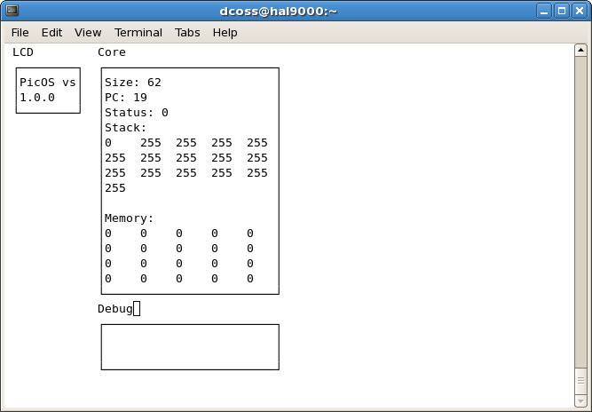

Description
===========

PICOS, or PIC Operating System, was created as a multitasking, programmable operating system for the PIC (http://en.wikipedia.org/wiki/PIC_microcontroller) microcontroller. The operating system has been designed with the PIC 18F2550 in mind, but should be easily portable to other chips. Additionally, the operating system kernel should be easily ported to other types of microcontrollers, such as Atmel, since all processor specific code is factored out of the kernel, see layer diagram below. The PICOS kernel and the emulator were written in C (http://en.wikipedia.org/wiki/C_(programming_language)). Hardware drivers for the Computer-Radio interface (http://electronics.davecoss.com/interface) were written in C for use with the Hi-Tech (http://www.htsoft.com/) C compiler. Apropos of the compiler, it is worth noting that the kernel itself does not contain processor specfic code and header includes, such as Hi-Tech's htc.h; all of the processor specific code should be placed in the hardware driver. PICOS uses its own filesystem, PICFS, which may be mounted using FUSE (http://fuse.sourceforge.net/). Also, PICOS can execute user programs in a custom machine code, for which the PICLANG programming language and compilers were created.

Kernel
======

PICOS uses a monolithic kernel. The PIC is programmed with firmware containing the OS; this firmware remains constant. When the devices is turned on, initialization processes are executed, including initializing IO ports and memory management. Then the system enters a process loop, which acts as a traditional shell (http://en.wikipedia.org/wiki/Shell_(computing)). Commands are entered, parsed and executed. When programs are being executed, the kernel executes a set number of operations of the program before deciding whether to switch to another program, continue executing the same program or prompt the use for the next command. In doing so, PICOS is a multitasking OS.

Memory Management
=================

All PIC devices contain on-board RAM. Within the PICOS, this is used by the kernel, with a section used as paged memory for running processes. When a user programs are executed, the PCB is loaded into a section of on-board RAM. Part of this PCB in RAM includes the arithmetic and call stacks. This improves the speed of system calls and arithmetic operations by putting this data in the memory closest to the CPU.

Additionally, SRAM is available to provided more volatile memory to the OS. The first block of SRAM contains the mount table. File addresses in secondary storage are stored in the mount table as 4-byte, big endian data. These addresses correspond to the address of the first byte of the file system image. 

After the mount table in SRAM is swap space for processes. When a program is loaded into memory, its contents are copied into SRAM. The process of accessing SRAM is faster than secondary storage; thus the speed of executing commands is increase by reading SRAM rather than using secondary storage. When a program is suspended, the PCB is transferred from on-board RAM to SRAM. When the program is resumed, it is copied back to on-board RAM.

Paged memory is located in on-board RAM, which pages being assigned to particular processes. By assigning the pages to programs, using a program ID number, programs are protected from unauthorized access of memory. Additionally, this paged memory allows programs to store data in the fastest memory area. The kernel manages the allocation and deallocation of this memory.

Secondary Storage
=================

PICOS has been designed to use SD cards as secondary storage. SD cards are treated as a flat data space, with 4 Gigabytes of addressable space. Data may be accessed byte-wise or in arbitrary sized blocks. Multiple PICFS images may be concatenated on the SD card, as file system images are identified by their beginning address.

Header Files
============

+---------------+-------------------------------------------------------------------------------------------------------------------+
| File          | Function                                                                                                          |
+---------------+-------------------------------------------------------------------------------------------------------------------+
| arg.h         | Handles command arguments, namely parsing and data type casting.                                                  |
+---------------+-------------------------------------------------------------------------------------------------------------------+
| io.h          | Provides IO abstraction for the OS and prototypes files that should be defined by hardware drives or an emulator. |
+---------------+-------------------------------------------------------------------------------------------------------------------+
| page.h        | Paged memory system used by PICOS and PICLANG                                                                     |
+---------------+-------------------------------------------------------------------------------------------------------------------+
| picfs_error.h | Enumerates error codes                                                                                            |
+---------------+-------------------------------------------------------------------------------------------------------------------+
| picfs.h       | File system which allows multiple PICFS images to be mounted on the device.                                       |
+---------------+-------------------------------------------------------------------------------------------------------------------+
| piclang.h     | Handles the running of PICLANG programs and provides an interface between running programs and the kernel.        |
+---------------+-------------------------------------------------------------------------------------------------------------------+
| picos_time.h  | Provides date and time functions and structures, with second precision.                                           |
+---------------+-------------------------------------------------------------------------------------------------------------------+
| scheduler.h   | Priority based, cyclical CPU scheduler.                                                                           |
+---------------+-------------------------------------------------------------------------------------------------------------------+
| utils.h       | Miscellaneous utility function prototypes.                                                                        |
+---------------+-------------------------------------------------------------------------------------------------------------------+

Emulator
========

A running PICOS circuit may be simulated using emulator code. Below is a screenshot of the emulator. The emulator code replaces hardware code, such as putch and getch, with system calls to interact with the terminal. A filesystem image is required. SRAM and EEPROM storage is simulated using files. This allows the user to read the contents of the simulated system's memory. The target OS of the emulator is Linux and requires the ncurses library for the display. The display shows the contents of the LCD buffer, program memory and a debugger information, if the debug flag has been set.

Scheduler
=========

Algorithm
---------

PICOS uses a priority based, cyclical scheduling algorithm. Each running process is given a certain amount of time which to run. A hardware timer periodically decrements the lifetime of the process. Once the process time has elapsed, the process is swapped into SRAM and placed in a wait queue. If other processes are in the wait queue, the next process is allowed to run. The order in which processes are placed into the wait queue is determined by a numerical priority.

Signals and Interrupts
----------------------

Multiple PICs, including the 18F2550, for which PICOS was designed, are able to interrupt the CPU when the input to a pin has changed. PICOS provides OS level access to these interrupts using signals. Upon a corresponding interrupt on the PIC, a signal is set if a process has requested to be notified. PICLANG programs may access these signals using the ''signal'' system call. The ''scheduler.h'' header contains a list of the signals.

Config File
===========

To simplify compilation, file system usage and emulation, various linux programs for PICOS may use a config file in the users home directory, called ''.picfsrc''. The format of the config file is 
<pre>NAME VAL</pre>
for each parameter to be set, one per line. Lines with the first non-space character as '#' are considered comments and ignored. Parameter names are ''case insensitive''.

Parameters include:
* BLOCK_SIZE  -- Default block size of the PICFS image, emulator buffer and PICLANG programs.
* NUM_BLOCKS -- Default number of blocks in a PICFS image.

Download
========

There are to options to install PICOS tools. Source code is available on github (https://github.com/kd0kfo/picos). Simply clone the repository by running

.. code::

    git clone git://github.com/kd0kfo/picos.git

or

.. code::

    git clone https://github.com/kd0kfo/picos.git

Debian Package
--------------

For debian system, binaries, sources and a sample PICFS image may be installed using a .deb package (http://research.davecoss.com/packages/picos/). The package places binaries in /usr/bin, sources in /usr/src/picos and a sample PICFS image in /usr/share/picos. 

Source files may be used to build PICOS as well utility programs such as picosc and fs.

